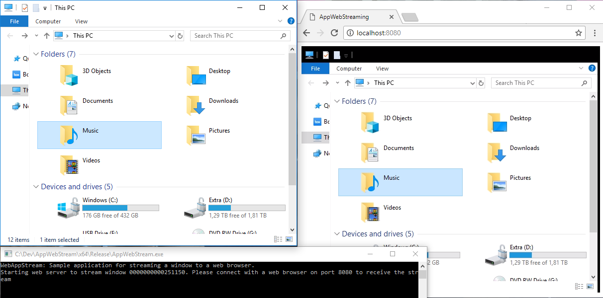

# AppWebStream
[Windows Media Foundation](https://msdn.microsoft.com/en-us/library/ms694197.aspx) and [FFMPEG](http://ffmpeg.org/) sample code for streaming an application window to a web browser. The video is encoded as a H.264 stream inside a fragmented MPEG4 container that is Media Source Extensions (MSE) compatible, so that it can be received by any modern web browser with minimal client-side buffering.

The streaming is primarily tested on and works best with Google Chrome.

### Getting started

* Open project in VS2015
* Build project
* Start `WebAppStream.exe port [window handle]`. You can use Spy++ (included with Visual Studio) to determine window handles.
* Open `localhost:[port]` in web browser, or on another computer.

To build with FFMPG, you first need to download & unzip FFMPEG binaries to a folder pointed to by the `FFMPEG_ROOT` environment variable. Then, set the `ENABLE_FFMPEG` preprocessor define before building.

### Media Foundation issues
* The MPEG4 fragments are transmitted 8 frames at a time over the network. Can be verified by inspecting the `sample_count` variable in `MP4FragmentEditor::ProcessTrackFrameChildren`. This leads to a 8 frame latency both at the server- and client-side. For a 25fps stream, this yields a minimum latency of 2 * 8frames * 40ms/frame = 640ms.
* The MPEG4 container needs to be manually modified as described in https://stackoverflow.com/questions/49429954/mfcreatefmpeg4mediasink-does-not-generate-mse-compatible-mp4 to make it Media Source Extensions (MSE) compatible.

The FFMPEG-based encoder is not affected by any of the issues above.

### Browser support
* Works best with Google Chrome.
* Works partly with Microsoft Edge, but with high latency (https://developer.microsoft.com/en-us/microsoft-edge/platform/issues/17410767/)
* Mozilla Firefox & Safary doesn't work yet due to insufficient of [Fetch API](https://developer.mozilla.org/en-US/docs/Web/API/Fetch_API) support
